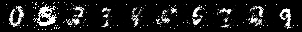

# Image-generators
In this project I trained two models from scratch to generate the given numbers as a picture by user

<p align="center">
  
</p>

The picture above is the output of the first model. I used Linear layers for both discriminator and generator. The output is acceptable considering the limits of fully connected layers. <br>
The picture below shows the final output of the convolution model. I used both upscaling and normal convolutional layers both in Discriminator and Generator. 

<p align="center">
  
</p>

More pictures of the first model in 
```
images
```
More pictures of the CNN output in:
```
images_CNN
```
The code is available in 
```
MNIST.ipynb
```
Also the saved trained models are as following:
```
discriminator.pth
generator.pth

discriminator_CNN.pth
generator_CNN.pth
```
